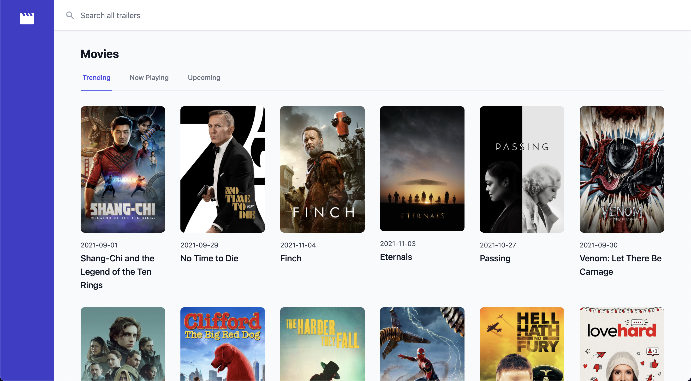

<p align="center"></p>

<p align="center">
    <a href="https://github.com/cgnetwork/trailarr/actions"></a>
  <a href="https://hub.docker.com/r/cgnetwork/trailarr"></a>
    <a href="https://hub.docker.com/r/cgnetwork/trailarr/tags"></a>
    <a href="https://github.com/cgnetwork/trailarr/blob/master/LICENSE"></a>
</p>

<h2 align="center">trailarr</h2>

trailarr is an easy to use, self hosted manager for all your movie and tv show trailers. Easily search and download trailers with these great features:

* A beautiful, easy to use interface.
* Queued trailer downloads.
* Readily configured out-of-the box.
* Batteries included.



## Usage

Docker compose example:

```yaml
version: '3'

services:
  trailarr:
    container_name: trailarr
    image: cgnetwork/trailarr:latest
    ports:
      - "80:8080"
    volumes:
      - /path/to/trailers:/trailers
    restart: unless-stopped
```

## Configuration

Trailers can be accessed on the host directory mounted to the container download directory:
```bash
/path/to/trailers:/trailers
```

## Contributing

Thank you for considering contributing to trailarr! We welcome all pull requests.

## License

trailarr is open-sourced software licensed under the [MIT license](LICENSE).
